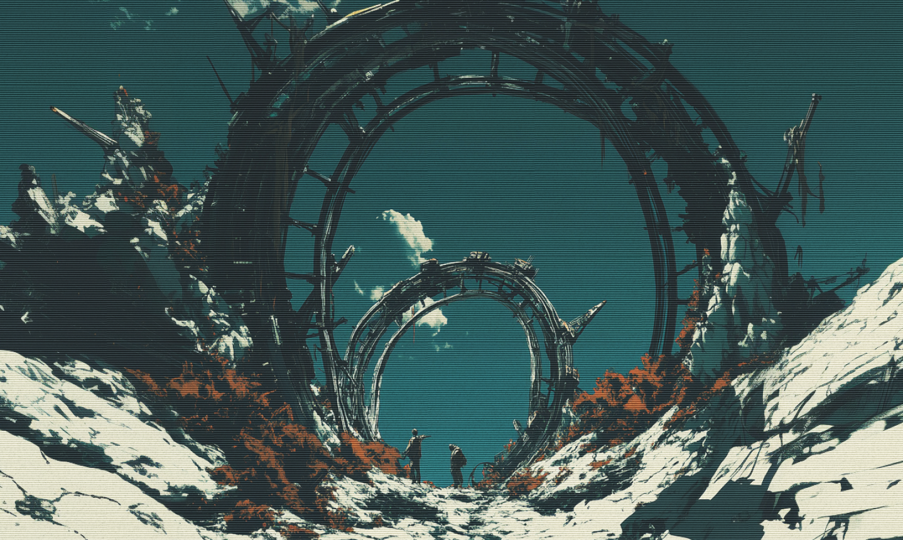

+++
title = "How to Democratise DevOps"
subline = "Or: The Long Search for a Mental Model"
date = 2025-04-06T21:25:04+07:00
draft = false
author = "Timo Busse"
tags = ['Design']
+++

Computers only became mainstream when interfaces borrowed from the analog world.
Suddenly, people weren’t staring at cryptic command lines, they had “desktops”,
“folders”, and “recycle bins”. Familiar metaphors turned, that digital complexity into something intuitive. They made digital complexity feel natural.

Design makes a product understandable. It slices through complexity and making things click. But what if what you’re designing is buried deep - abstract, technical and invisible to almost everyone?

That is the challenge we face at Clan. How do we design infrastructure and networking concepts in a visual application so that they are not only understandable but truly usable by anyone?

_To develop a further sense of legacy interfaces and their calmness visit [toastytech.com](http://toastytech.com/guis/index.html)_

_Machintosh in 1984 and a screenshot of the Note Pad application_

A strong metaphor unlocks a mental model, which is the blueprint of every truly intuitive user experience. Because here is the truth: Without it, even the best tools feel like black boxes.

So where do we find ours? To design the how, we need to understand the why. Why are we building Clan? And why do we want to democratize networking through an application?

Because the digital world has drifted off course. Our devices have become closed boxes. Platforms addict and manipulate. Social media fractures societies and AI is blurring the line between real and fake by the day.

The original promise of computing was a different one. When the machines entered our homes, they invited tinkering. You had to understand how they worked. You had to code. The barrier to entry wasn’t hidden, it was the whole point.

Then came the internet: A wave of openness where content flowed freely. Industries were disrupted and subcultures found one another. There was magic in that beginning.

Today the internet is a never-ending ad. Everything is tracked. Everyone is categorized. The internet overwhelms. The global community is a dead-end, leaving people drained, disoriented, and empty. Idealized images, outrage, surveillance, burnout.

So what do we do? We take back the computer! We stop being just users, and start being makers again. Not with likes, but with ideas. With uncertainty. With a bit of beautiful chaos.

A quiet revolution. From the inside.

We reclaim the machine. We understand it. We use its building blocks to shape spaces of our own, digital enclaves outside the reach of the algorithmic hive mind.

That’s why we’re building Clan: to make room for a better digital society.

And here’s the metaphor at the heart of our mission: Computers are like houses. You build them. Connect them. Neighborhoods form. Villages grow. Cities emerge. Societies take shape.

Inspired by games like [SimCity](https://www.youtube.com/watch?v=jk7BkwksgX8&ab_channel=SergiuHellDragoonHQ), we use the metaphor of a digital city to represent networks and infrastructure. But this isn’t a simulation! It’s real, deployed architecture! It’s not just about designing, it’s about actually building, managing, and maintaining technical systems.

At its core, our visual tool is a network simulation game with real technical infrastructure behind it. This is how we make complex systems understandable: playfully, visually, tangibly.

_Clan’s Darknet Builder with already created machines_

_A more advanced build of a network and its respective machines_

_Some details of Clan’s Darknet Builder UI_

It’s our way of rethinking networks and infrastructure and inviting everyone to become the architect of their own digital world!

This is the Darknet Builder by Clan.



That’s how we make complexity understandable.
That’s how we democratise DevOps.

Time to architect.
