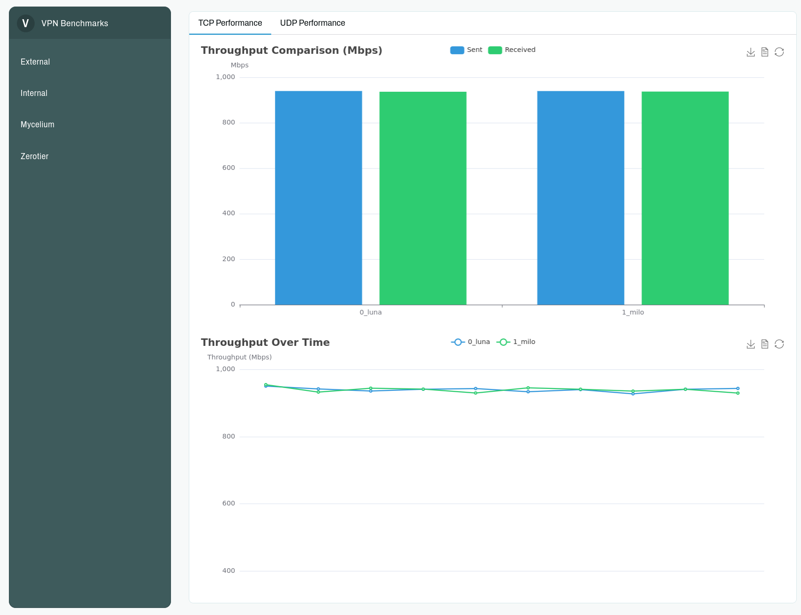

+++
title= "VPN Benchmarks Part 1"
subline= "A framework for automated distributed network tests"
date= 2025-03-07T00:08:10+02:00
author= "Qubasa"
tags = ['Dev Report']
+++


Which VPN technology really stands out? How efficiently does it scale, and how does it perform under poor network conditions? These are the questions that arise when faced with the endless array of VPN options—yet hard data remains scarce. Often, if you ask around, you'll hear someone say, "I tried $VPN and it works perfectly for me," while another retorts, "But it kept crashing for me during $vacation."

Well, I say enough with this hearsay! It’s time to move beyond anecdotal evidence and start benchmarking. Let's establish a fully automated, reproducible testing approach so that we can clearly track improvements over time.

At least, that’s our goal. I’ve begun implementing the [vpn-benchmark](https://git.clan.lol/Qubasa/vpn-benchmark) using the Clan Python API (which isn’t stable right now) in combination with the cloud API abstraction [opentofu](https://opentofu.org/) - the open source equivalent of Terraform. With this setup, a user simply needs to execute:

```bash
  nix shell git+https://git.clan.lol/Qubasa/vpn-benchmark.git#vpn-bench --refresh
```

To get a shell that includes our package, `vpb`. Within this shell, you can run the command `vpb create` to automatically launch Hetzner Cloud machines for benchmarking. These machines are provisioned with a generated SSH key. The tool accomplishes this by defining a user_data section within our opentofu script, which contains a YAML configuration string. This format is standardized across cloud vendors and documented at [cloudinit.readthedocs.io](https://cloudinit.readthedocs.io/en/latest/reference/yaml_examples/set_passwords.html).

However, there was one issue. When logging into a Hetzner machine for the first time, a prompt appears asking the user to change the root password. Normally, adding an SSH key to the machine disables this prompt—but due to a bug, the prompt persists when the SSH key is deployed through the user_data section. Fortunately, the user_data configuration also allows us to change user passwords, which effectively resolves this problem.

```terraform {hl_lines=[14, 18]}
resource "hcloud_server" "servers" {
  for_each = { for server in var.servers : server.name => server }

  name        = each.value.name
  server_type = each.value.server_type
  image       = var.os_image
  location    = each.value.location

  # This is the cloudinit config
  user_data = <<-EOF
    #cloud-config
    ssh_authorized_keys:
      - ${join("\n  - ", var.ssh_pubkeys)}
    ssh_pwauth: false
    chpasswd:
      expire: false
      users:
      - {name: root, password: Sahb7pied8, type: text}
  EOF
}
```

Nextup a user can execute `vpb install` this is where the Clan magic happens. We create a temporary Clan inside the `~/.local/share/vpn_bench/clan` folder, and then create a dynamic amount of machines inside that Clan. 

With the power of [nixos-anywhere](https://github.com/nix-community/nixos-anywhere), we can transform any pre-installed Linux OS into our own NixOS-based system. In addition, [nixos-facter](https://github.com/nix-community/nixos-facter) generates a hardware report to ensure that all necessary drivers are included—without any user interaction. If you're interested in the code, check out the install.py file in our repository: [install.py](https://git.clan.lol/Qubasa/vpn-benchmark/src/branch/main/pkgs/vpn-bench/vpn_bench/install.py).

Once the infrastructure is in place, executing `vpb bench` initiates a suite of benchmarks across all supported VPN technologies. For more targeted testing, users can specify a particular VPN with `vpb bench --vpn <name>`. This command triggers a `clan machine update` process behind the scenes, leveraging Clan's Inventory system to dynamically configure each machine in the test network.

Clan's Inventory system is the secret sauce that makes this all possible. It provides a programmatic interface to define which services and Nix modules should be enabled on each node in our distributed benchmark environment. Because the Inventory is fully JSON-serializable, our Python code can easily manipulate configurations on the fly, enabling us to test multiple VPN setups with varying parameters in a single automated run. This approach ensures consistent, reproducible results that can be tracked over time, finally giving us objective data to evaluate VPN performance claims.

To then visualize the data a user can execute `vpb bench` this will build a static website with Nix and serve it over http once compiled.



The current testing methodology is fairly basic, only using `iperf3` to benchmark throughput and packetloss. However in the upcoming weeks we plan on extending this, to test things like packet delay, packet reordering, node failures and of course more VPNs.


One thing one has to look out for is the fact that cloud VMs could share a network card with a noisy neigbhour generating lots of traffic and thus skewing the results. But that case should be fairly obvious to spot when looking at the ground truth benchmarks that are not using any kind of VPN. 


An interesting finding from our preliminary tests revealed that UDP throughput between VMs was significantly lower than TCP throughput in the baseline tests. This counterintuitive result likely stems from Hetzner's UDP traffic throttling within their NAT infrastructure. One  approach to circumvent this limitation could be implementing tests using the QUIC protocol, which might be whitelisted due to being a webstandard.

For now that's how far the project is, please note that it's not yet ready to be used.

Cheers!